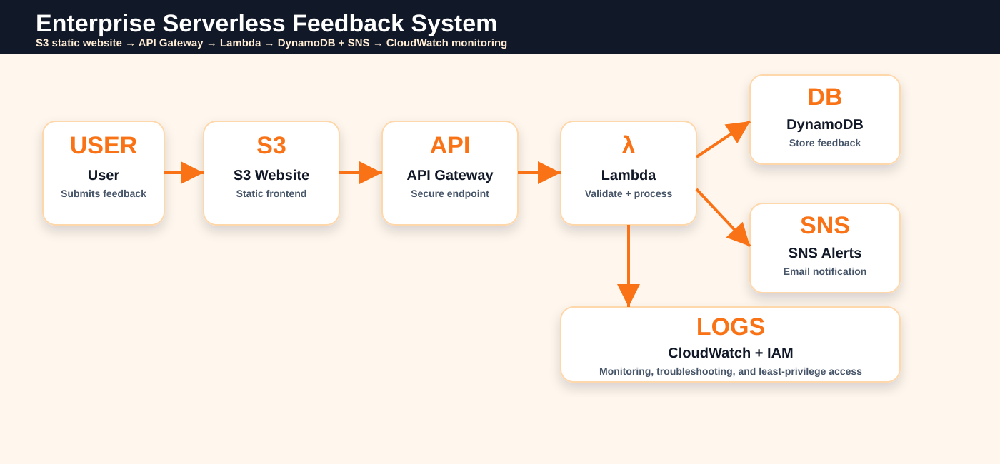

# Enterprise Serverless Feedback System


**Serverless feedback system using S3, API Gateway, Lambda, DynamoDB, SNS, IAM, and CloudWatch for secure feedback submission, storage, alerts, and monitoring.**

---

## Architecture Overview

<p align="center">
  
</p>

---

## What This Project Solves

Companies often need a lightweight feedback workflow for customers, employees, or internal teams. Traditional systems require backend servers, database administration, scaling, monitoring, and notification setup.

This project solves that using AWS serverless services:

```text
User → S3 Static Website → API Gateway → Lambda → DynamoDB + SNS → CloudWatch
```

---

## Key Features

| Area | Implementation |
|---|---|
| Frontend | Static HTML/CSS/JS feedback form |
| Hosting | Amazon S3 static website hosting |
| API Layer | API Gateway HTTP API endpoint |
| Backend | AWS Lambda Python handler |
| Database | DynamoDB feedback table |
| Notification | SNS email alert for new feedback |
| Monitoring | CloudWatch logs for troubleshooting |
| Security | IAM role, validation, CORS, email masking in alerts |
| Infrastructure | AWS SAM template for repeatable deployment |
| CI/CD | GitHub Actions syntax validation |

---

## Repository Structure

```text
enterprise-serverless-feedback-system/
├── .github/workflows/
│   └── ci.yml
├── docs/
│   ├── images/
│   │   └── serverless-feedback-architecture.svg
│   ├── deployment-guide.md
│   └── recruiter-scorecard.md
├── frontend/
│   ├── index.html
│   ├── style.css
│   └── app.js
├── infrastructure/
│   └── aws-sam/
│       └── template.yaml
├── lambda/
│   ├── handler.py
│   └── requirements.txt
├── .gitignore
└── README.md
```

---

## Quick Start

### 1. Clone the repo

```bash
git clone https://github.com/ghostironvault23-alphawork/enterprise-serverless-feedback-system.git
cd enterprise-serverless-feedback-system
```

### 2. Review Lambda code

```bash
python -m py_compile lambda/handler.py
```

### 3. Deploy with AWS SAM

```bash
cd infrastructure/aws-sam
sam build
sam deploy --guided
```

After deployment, copy the `FeedbackApiUrl` output.

### 4. Connect frontend to API Gateway

Open:

```text
frontend/app.js
```

Replace:

```text
REPLACE_WITH_API_GATEWAY_URL
```

with your deployed API Gateway `/feedback` URL.

### 5. Upload frontend to S3

Upload these files to your S3 static website bucket:

```text
frontend/index.html
frontend/style.css
frontend/app.js
```

Then open the S3 static website URL and submit feedback.

---

## API Request Example

```bash
curl -X POST "https://YOUR_API_ID.execute-api.YOUR_REGION.amazonaws.com/feedback" \
  -H "Content-Type: application/json" \
  -d '{
    "name": "Demo User",
    "email": "demo@example.com",
    "rating": 5,
    "message": "The service experience was excellent.",
    "source": "s3-static-website"
  }'
```

Expected response:

```json
{
  "message": "Feedback submitted successfully",
  "feedbackId": "generated-uuid"
}
```

---

## AWS Service Mapping

| Requirement | AWS Service |
|---|---|
| Static feedback form | Amazon S3 |
| Public API endpoint | API Gateway HTTP API |
| Backend processing | AWS Lambda |
| Feedback storage | DynamoDB |
| Email notification | SNS |
| Logs and debugging | CloudWatch Logs |
| Service permissions | IAM |
| Repeatable deployment | AWS SAM |

---

## Security and Production Notes

| Control | Purpose |
|---|---|
| Input validation | Prevents bad or incomplete feedback data |
| IAM role | Gives Lambda only required service access |
| CORS control | Restricts which frontend can call the API |
| Email masking | Reduces sensitive data exposure in alerts |
| CloudWatch logs | Helps trace failures and troubleshoot Lambda/API issues |
| DynamoDB encryption | Protects stored feedback data at rest |

For production, add CloudFront + Origin Access Control, WAF, API throttling, least-privilege custom IAM policies, DynamoDB point-in-time recovery, and CloudWatch alarms.

---

## Recruiter Pitch

> I built an enterprise-style serverless feedback system on AWS. The frontend is hosted on S3, submissions go through API Gateway, Lambda validates and processes the data, DynamoDB stores the feedback, SNS sends notifications, and CloudWatch provides monitoring. The project demonstrates serverless architecture, event-driven design, IAM-aware security, API integration, and production deployment planning.

---

## Documentation

| Document | Purpose |
|---|---|
| `docs/deployment-guide.md` | GUI and SAM deployment steps |
| `docs/recruiter-scorecard.md` | Recruiter POV score and improvement plan |
| `docs/images/serverless-feedback-architecture.svg` | Architecture diagram |

---

## Best GitHub Topics

Add these manually from **Repo → Settings → Topics**:

```text
aws
serverless
lambda
api-gateway
dynamodb
sns
s3
cloudwatch
iam
cloud-engineering
cloud-security
aws-project
feedback-system
```

---

## License

MIT License
