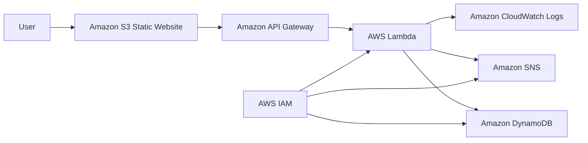

# Enterprise-Level Serverless Feedback Collection System


---

## Project Introduction

This project is an **enterprise-level AWS serverless feedback collection system**.

The purpose of this project is to collect feedback from users through a static website, process the submitted data securely, store it in a database, send notification alerts, and monitor the complete workflow using AWS services.

This project uses a fully serverless architecture, which means there is no need to manage servers, operating systems, patching, scaling, or backend infrastructure manually.

---

## What Problem Are We Solving?

Many companies need a simple and reliable way to collect feedback from users, customers, employees, or internal teams.

A traditional feedback system usually requires:

- Web server setup
- Backend server management
- Database administration
- Manual scaling
- Security configuration
- Monitoring setup
- Notification system
- Server maintenance

This project solves the problem by using AWS serverless services.

The user submits feedback from a web form hosted on Amazon S3. The feedback is sent to API Gateway, processed by AWS Lambda, stored in DynamoDB, and notification alerts are sent using Amazon SNS.

---

## Project Overview

The system follows a simple but production-style cloud architecture.

### Main Workflow

1. User opens the feedback form.
2. The form is hosted on Amazon S3 as a static website.
3. User submits feedback details.
4. The frontend sends the request to Amazon API Gateway.
5. API Gateway triggers an AWS Lambda function.
6. Lambda validates and processes the feedback.
7. Lambda stores the data in Amazon DynamoDB.
8. Lambda sends a notification using Amazon SNS.
9. CloudWatch captures logs for monitoring and troubleshooting.
10. IAM controls secure permissions between services.

---

## Architecture Flow



---

## Architecture Explanation

| Layer | AWS Service | Purpose |
|---|---|---|
| Frontend Layer | Amazon S3 | Hosts the static feedback form |
| API Layer | API Gateway | Provides HTTP API endpoint |
| Compute Layer | AWS Lambda | Processes and validates feedback |
| Database Layer | DynamoDB | Stores submitted feedback records |
| Notification Layer | SNS | Sends email or SMS alerts |
| Security Layer | IAM | Controls service permissions |
| Monitoring Layer | CloudWatch | Stores logs and helps troubleshooting |

---

## AWS Services Used

| AWS Service | Use in This Project |
|---|---|
| Amazon S3 | Used to host the static feedback website |
| Amazon API Gateway | Used to create the API endpoint for form submission |
| AWS Lambda | Used as serverless backend logic |
| Amazon DynamoDB | Used to store feedback records |
| Amazon SNS | Used to send notification alerts |
| AWS IAM | Used to manage secure permissions |
| Amazon CloudWatch | Used for logs, monitoring, and debugging |

---

## Tools and Software Used

| Tool | Purpose |
|---|---|
| AWS Management Console | GUI-based AWS deployment |
| VS Code | Code editing |
| GitHub | Project documentation and version control |
| Postman | API testing |
| Browser Developer Tools | Frontend debugging |
| CloudWatch Logs | Runtime troubleshooting |
| Draw.io / Canva | Architecture diagram creation |

---

## Repository Structure

```text
enterprise-serverless-feedback-system/
│
├── README.md
│
├── architecture/
│   └── serverless-feedback-architecture.png
│
├── frontend/
│   ├── index.html
│   ├── style.css
│   └── app.js
│
├── lambda/
│   ├── handler.py
│   └── requirements.txt
│
├── screenshots/
│   ├── s3-hosting-sample.png
│   ├── api-gateway-sample.png
│   ├── lambda-console-sample.png
│   ├── dynamodb-table-sample.png
│   └── cloudwatch-logs-sample.png
│
└── postman/
    └── feedback-api-collection.json
```

---

# Complete GUI Step-by-Step Implementation Guide

---

## Step 1: Create Amazon S3 Bucket

1. Open **AWS Management Console**.
2. Search for **S3**.
3. Click **Create bucket**.
4. Enter a unique bucket name.

Example:

```text
feedback-form-website-project
```

5. Select your AWS Region.
6. Keep default object ownership.
7. For demo static hosting, configure public access carefully.
8. Click **Create bucket**.

---

## Step 2: Enable Static Website Hosting

1. Open the created S3 bucket.
2. Go to the **Properties** tab.
3. Scroll down to **Static website hosting**.
4. Click **Edit**.
5. Select **Enable**.
6. Choose **Host a static website**.
7. Enter:

```text
Index document: index.html
Error document: index.html
```

8. Click **Save changes**.
9. Copy the S3 static website endpoint.

---

## Step 3: Upload Frontend Files to S3

Create and upload these files:

```text
index.html
style.css
app.js
```

Steps:

1. Open your S3 bucket.
2. Click **Upload**.
3. Add the frontend files.
4. Click **Upload**.
5. Open the S3 static website URL.
6. Confirm that the feedback form loads properly.

---

## Step 4: Configure S3 Bucket Policy

1. Open the S3 bucket.
2. Go to **Permissions**.
3. Click **Bucket policy**.
4. Add a public read policy for demo static website access.

Example:

```json
{
  "Version": "2012-10-17",
  "Statement": [
    {
      "Sid": "PublicReadForStaticWebsite",
      "Effect": "Allow",
      "Principal": "*",
      "Action": "s3:GetObject",
      "Resource": "arn:aws:s3:::feedback-form-website-project/*"
    }
  ]
}
```

Replace the bucket name with your actual bucket name.

---

## Step 5: Create DynamoDB Table

1. Search for **DynamoDB**.
2. Click **Create table**.
3. Enter table name:

```text
FeedbackTable
```

4. Partition key:

```text
feedbackId
```

5. Data type: **String**
6. Keep default settings.
7. Click **Create table**.

---

## Step 6: Create SNS Topic

1. Search for **SNS**.
2. Click **Topics**.
3. Click **Create topic**.
4. Select **Standard**.
5. Topic name:

```text
feedback-alert-topic
```

6. Click **Create topic**.

---

## Step 7: Create SNS Email Subscription

1. Open the SNS topic.
2. Click **Create subscription**.
3. Select protocol:

```text
Email
```

4. Enter your email address.
5. Click **Create subscription**.
6. Open your email inbox.
7. Confirm the SNS subscription.

Without confirming the email subscription, SNS notifications will not be delivered.

---

## Step 8: Create IAM Role for Lambda

1. Search for **IAM**.
2. Click **Roles**.
3. Click **Create role**.
4. Trusted entity type: **AWS Service**
5. Use case: **Lambda**
6. Click **Next**.
7. Attach permissions for demo:

```text
AWSLambdaBasicExecutionRole
AmazonDynamoDBFullAccess
AmazonSNSFullAccess
```

For production, use least-privilege custom policies instead of full-access policies.

8. Role name:

```text
lambda-feedback-execution-role
```

9. Click **Create role**.

---

## Step 9: Create AWS Lambda Function

1. Search for **Lambda**.
2. Click **Create function**.
3. Select **Author from scratch**.
4. Function name:

```text
feedback-processor-lambda
```

5. Runtime:

```text
Python 3.11
```

6. Select the IAM role created earlier.
7. Click **Create function**.

---

## Step 10: Add Lambda Environment Variables

1. Open the Lambda function.
2. Go to **Configuration**.
3. Click **Environment variables**.
4. Add:

```text
DYNAMODB_TABLE=FeedbackTable
SNS_TOPIC_ARN=your-sns-topic-arn
```

5. Click **Save**.

---

## Step 11: Add Lambda Backend Code

Use this sample Lambda function:

```python
import json
import os
import uuid
from datetime import datetime, timezone

import boto3

dynamodb = boto3.resource("dynamodb")
sns = boto3.client("sns")

TABLE_NAME = os.environ.get("DYNAMODB_TABLE", "FeedbackTable")
SNS_TOPIC_ARN = os.environ.get("SNS_TOPIC_ARN", "")

table = dynamodb.Table(TABLE_NAME)


def lambda_handler(event, context):
    try:
        body = json.loads(event.get("body", "{}"))

        required_fields = ["name", "email", "rating", "message"]
        missing_fields = [field for field in required_fields if not body.get(field)]

        if missing_fields:
            return build_response(400, {
                "message": "Missing required fields",
                "missingFields": missing_fields
            })

        feedback_id = str(uuid.uuid4())

        item = {
            "feedbackId": feedback_id,
            "name": body["name"],
            "email": body["email"],
            "rating": str(body["rating"]),
            "message": body["message"],
            "createdAt": datetime.now(timezone.utc).isoformat()
        }

        table.put_item(Item=item)

        if SNS_TOPIC_ARN:
            sns.publish(
                TopicArn=SNS_TOPIC_ARN,
                Subject="New Feedback Received",
                Message=json.dumps(item, indent=2)
            )

        return build_response(200, {
            "message": "Feedback submitted successfully",
            "feedbackId": feedback_id
        })

    except Exception as error:
        print(f"Error processing feedback: {str(error)}")

        return build_response(500, {
            "message": "Internal server error"
        })


def build_response(status_code, body):
    return {
        "statusCode": status_code,
        "headers": {
            "Content-Type": "application/json",
            "Access-Control-Allow-Origin": "*",
            "Access-Control-Allow-Headers": "Content-Type",
            "Access-Control-Allow-Methods": "OPTIONS,POST"
        },
        "body": json.dumps(body)
    }
```

After pasting the code:

1. Click **Deploy**.
2. Create a Lambda test event.
3. Test the function.
4. Check CloudWatch logs if any error appears.

---

## Step 12: Create API Gateway

1. Search for **API Gateway**.
2. Click **Create API**.
3. Select **HTTP API**.
4. Click **Build**.
5. Add Lambda integration.
6. Select:

```text
feedback-processor-lambda
```

7. API name:

```text
feedback-api
```

8. Click **Next**.

---

## Step 13: Create API Route

1. Create route:

```text
POST /feedback
```

2. Attach the Lambda integration.
3. Enable CORS.
4. Allow method:

```text
POST
OPTIONS
```

5. Allow header:

```text
Content-Type
```

6. Deploy the API.
7. Copy the invoke URL.

Example:

```text
https://abc123.execute-api.ap-south-1.amazonaws.com/feedback
```

---

## Step 14: Connect Frontend with API Gateway

In `app.js`, add your API Gateway invoke URL:

```javascript
const API_ENDPOINT = "PASTE_YOUR_API_GATEWAY_INVOKE_URL_HERE";
```

Sample frontend JavaScript:

```javascript
const API_ENDPOINT = "PASTE_YOUR_API_GATEWAY_INVOKE_URL_HERE";

document.getElementById("feedbackForm").addEventListener("submit", async function (event) {
  event.preventDefault();

  const status = document.getElementById("status");

  const payload = {
    name: document.getElementById("name").value,
    email: document.getElementById("email").value,
    rating: document.getElementById("rating").value,
    message: document.getElementById("message").value
  };

  try {
    const response = await fetch(API_ENDPOINT, {
      method: "POST",
      headers: {
        "Content-Type": "application/json"
      },
      body: JSON.stringify(payload)
    });

    if (!response.ok) {
      throw new Error("Feedback submission failed");
    }

    status.textContent = "Feedback submitted successfully.";
    status.style.color = "green";
    document.getElementById("feedbackForm").reset();
  } catch (error) {
    status.textContent = "Error submitting feedback. Please try again.";
    status.style.color = "red";
    console.error(error);
  }
});
```

Upload the updated `app.js` file back to S3.

---

## Step 15: Test Using Browser

1. Open the S3 static website endpoint.
2. Fill the feedback form.
3. Submit the form.
4. Confirm success message.
5. Check DynamoDB table.
6. Check SNS email notification.
7. Check CloudWatch logs.

---

## Step 16: Test Using Postman

1. Open Postman.
2. Select method:

```text
POST
```

3. Paste API Gateway invoke URL.
4. Go to **Body**.
5. Select **raw**.
6. Select **JSON**.
7. Add sample request:

```json
{
  "name": "Test User",
  "email": "test@example.com",
  "rating": "5",
  "message": "This is a test feedback submission."
}
```

8. Click **Send**.
9. Confirm response success.
10. Check DynamoDB and SNS.

---

## Step 17: Monitor Logs in CloudWatch

1. Search for **CloudWatch**.
2. Go to **Log groups**.
3. Search for:

```text
/aws/lambda/feedback-processor-lambda
```

4. Open the latest log stream.
5. Check:

- Request payload
- Lambda execution status
- DynamoDB write status
- SNS publish status
- Error messages
- Execution duration

---

# Testing Checklist

## S3 Testing

- [ ] S3 bucket created
- [ ] Static website hosting enabled
- [ ] `index.html` uploaded
- [ ] `style.css` uploaded
- [ ] `app.js` uploaded
- [ ] S3 website URL opens correctly
- [ ] Feedback form loads properly

## API Gateway Testing

- [ ] HTTP API created
- [ ] POST route created
- [ ] Lambda integration attached
- [ ] CORS enabled
- [ ] API invoke URL generated
- [ ] API tested using Postman

## Lambda Testing

- [ ] Lambda function created
- [ ] IAM role attached
- [ ] Environment variables added
- [ ] Lambda code deployed
- [ ] Test event runs successfully
- [ ] Error handling tested

## DynamoDB Testing

- [ ] Table created
- [ ] Partition key configured
- [ ] Feedback record inserted
- [ ] Data visible in table items

## SNS Testing

- [ ] SNS topic created
- [ ] Email subscription created
- [ ] Email subscription confirmed
- [ ] Notification received after feedback submission

## CloudWatch Testing

- [ ] Log group created
- [ ] Lambda logs visible
- [ ] Errors checked
- [ ] Execution duration checked

## Final End-to-End Testing

- [ ] Open S3 website
- [ ] Submit feedback form
- [ ] Verify success message
- [ ] Verify DynamoDB record
- [ ] Verify SNS notification
- [ ] Verify CloudWatch logs

---

# Troubleshooting Guide

## Issue 1: S3 Website Not Opening

### Possible Reasons

- Static website hosting is disabled
- Bucket policy is missing
- Public access is blocked
- `index.html` is missing

### Fix

- Enable static website hosting
- Upload `index.html`
- Check bucket policy
- Verify public read access for demo

---

## Issue 2: Access Denied on S3 Website

### Possible Reasons

- Block Public Access is enabled
- Bucket policy is incorrect
- Wrong object path

### Fix

- Check bucket policy
- Confirm file names
- Confirm `index.html` exists
- Use the correct S3 website endpoint

---

## Issue 3: CORS Error in Browser

### Possible Reasons

- CORS is not enabled in API Gateway
- Wrong API endpoint in frontend
- Missing headers

### Fix

Enable CORS with:

```text
Access-Control-Allow-Origin: *
Access-Control-Allow-Headers: Content-Type
Access-Control-Allow-Methods: POST, OPTIONS
```

---

## Issue 4: Lambda Cannot Write to DynamoDB

### Possible Reasons

- Wrong table name
- Missing environment variable
- IAM role does not have DynamoDB permission

### Fix

- Check `DYNAMODB_TABLE`
- Check Lambda execution role
- Check DynamoDB table name
- Review CloudWatch logs

---

## Issue 5: SNS Email Not Received

### Possible Reasons

- Email subscription not confirmed
- Wrong SNS topic ARN
- Lambda lacks SNS permission

### Fix

- Confirm email subscription
- Verify `SNS_TOPIC_ARN`
- Check Lambda IAM role
- Review CloudWatch logs

---

## Issue 6: API Works in Postman but Not Browser

### Possible Reasons

- CORS issue
- Wrong frontend API URL
- JavaScript fetch error

### Fix

- Enable CORS
- Check browser developer console
- Confirm API Gateway endpoint
- Upload updated `app.js` to S3

---

# Screenshots to Add

Add real AWS screenshots in the `screenshots/` folder.

Recommended screenshot names:

```text
screenshots/s3-hosting-sample.png
screenshots/api-gateway-sample.png
screenshots/lambda-console-sample.png
screenshots/dynamodb-table-sample.png
screenshots/cloudwatch-logs-sample.png
```

Recommended screenshot order:

1. Architecture diagram
2. S3 bucket created
3. Static website hosting enabled
4. Frontend files uploaded
5. DynamoDB table created
6. SNS topic created
7. SNS email subscription confirmed
8. IAM Lambda role created
9. Lambda function code
10. API Gateway route created
11. API Gateway Lambda integration
12. Browser feedback form test
13. DynamoDB stored feedback record
14. SNS email notification
15. CloudWatch logs

---

# Future Scope and Improvements

| Improvement | Description |
|---|---|
| Amazon Cognito | Add secure user login and authentication |
| AWS WAF | Protect APIs from common web attacks |
| AWS Shield | Add DDoS protection |
| Amazon Kinesis | Add real-time feedback analytics |
| Amazon Aurora | Add relational reporting support |
| Amazon QuickSight | Create dashboards and business insights |
| AWS Step Functions | Manage complex workflows |
| Amazon Comprehend | Add sentiment analysis |
| GitHub Actions | Automate CI/CD deployment |
| Multi-region Deployment | Improve availability and disaster recovery |
| Secrets Manager | Store sensitive values securely |
| X-Ray | Trace request flow and debug performance |

---

# Individual Contribution

This project was completed as a self-driven cloud engineering project.

My contribution includes:

- Planned the complete serverless architecture
- Designed the project workflow
- Configured AWS services using the AWS Console
- Created frontend feedback form structure
- Designed Lambda-based backend processing
- Planned DynamoDB feedback storage
- Configured SNS notification workflow
- Applied IAM role-based access control
- Used CloudWatch for monitoring and troubleshooting
- Tested the application using browser and Postman
- Documented the project professionally for GitHub and resume use

---

# Resume-Ready Project Description

Designed and implemented an enterprise-level serverless feedback collection system using AWS S3, API Gateway, Lambda, DynamoDB, SNS, IAM, and CloudWatch. Built a static frontend hosted on Amazon S3, integrated it with API Gateway and Lambda for backend processing, stored feedback records in DynamoDB, and configured SNS for real-time notifications. Applied IAM-based access control and used CloudWatch for logging, monitoring, and troubleshooting.

---

# Interview Explanation

I built this project to understand how a real serverless application works on AWS.

The frontend is hosted on Amazon S3 as a static website. When the user submits feedback, the request goes to API Gateway, which triggers a Lambda function. Lambda validates the data, stores the feedback in DynamoDB, and sends a notification through SNS.

IAM roles are used to provide secure access between services, and CloudWatch is used to monitor logs and errors.

This project helped me understand serverless architecture, API integration, event-driven processing, NoSQL storage, notification systems, IAM permissions, and cloud monitoring.

---

# Key Learning Outcomes

Through this project, I learned:

- How to design a serverless AWS architecture
- How to host a static website using Amazon S3
- How to expose APIs using API Gateway
- How to process backend logic using Lambda
- How to store NoSQL data using DynamoDB
- How to send notifications using SNS
- How to configure IAM permissions securely
- How to monitor serverless applications using CloudWatch
- How to test APIs using Postman
- How to structure and document a GitHub project professionally

---

# Final Result

This project demonstrates how a basic feedback collection use case can be transformed into a scalable, secure, and production-style AWS serverless application.

It is suitable for:

- Cloud Engineer portfolio
- AWS fresher resume project
- Serverless architecture practice
- Interview explanation
- GitHub project showcase
